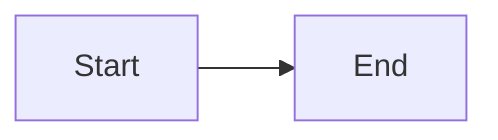

# AGENTS.md — blog

## Tech Stack

| Layer | Technology |
|---|---|
| Framework | Astro v6 |
| CSS | Tailwind CSS v4 (via `@tailwindcss/vite`) |
| Typography | `@tailwindcss/typography` (`.prose`) |
| UI | Astro components (`.astro`), React 19 for interactive islands |
| Diagrams | Mermaid via `astro-mermaid` (client-side, dark theme) |
| Content | Astro Content Collections (Markdown + MDX) |
| Fonts | Inter (sans), JetBrains Mono (code) via Google Fonts |
| Language | Vietnamese (`lang="vi"`) |

## Commands

| Command | What it does |
|---|---|
| `npm run dev` | Astro dev server |
| `npm run build` | `astro build` — static site to `dist/` |
| `npm run preview` | Astro preview of built `dist/` |

No linter or test framework configured.

## Deployment

GitHub Pages via [`actions/deploy-pages`](https://github.com/actions/deploy-pages) on push to `main`.

| Config | Value |
|---|---|
| Site URL | `https://nghiaxh.github.io` |
| Base path | `/blog` (`astro.config.mjs` → `base: '/blog'`) |
| Build output | `dist/` |
| Node version | 22 |

Workflow file: `.github/workflows/deploy.yml`.

## Theme (dark-only)

Theme values defined in `src/styles/global.css` via Tailwind v4 `@theme`:

| Class | Hex | Used for |
|---|---|---|
| `text-fg` / `bg-fg` | `#e5e5e5` | Main content (body, headings, links) |
| `text-primary` / `bg-primary` | `#60a5fa` | Accent color (links) |
| `bg-bg` | `#0a0a0a` | Page background |
| `border-border` | `#262626` | Borders |

**No light mode.** Site runs fixed dark theme. Do not use `dark:` variants.

## Text color rules

Always use `text-fg` for all text: body, headings, list items, metadata, back link, year labels, footer, nav links, project descriptions.

Links default to `text-primary`, hover changes to `text-fg` with `hover:underline`.

## Prose (blog post body)

`src/styles/global.css` overrides `--tw-prose-*` variables. Blog content sits inside `<div class="prose prose-neutral max-w-none">`.

## Mermaid

Configured in `astro.config.mjs` — `mermaid({ theme: 'dark', autoTheme: true })`.

Used in Markdown/MDX:

````

````

Renders client-side (does not affect build time). Site uses dark theme so `theme: 'dark'`.

## Favicon

`public/favicon.svg` — black background (`#111`), white **N** letter, 6px rounded corners.

## Content collection (blog)

Schema (Zod) in `src/content.config.ts`:
- `title` (string), `description` (string), `pubDate` (date)
- `updatedDate` (date, optional), `tags` (string[], optional)
- `coverImage` (string, optional), `draft` (boolean, default false)

## Routing

`base: '/blog'` (GitHub Pages project site).

| Route | File | Actual URL |
|---|---|---|
| `/` | `src/pages/index.astro` | `/blog/` |
| `/[slug]` | `src/pages/[...slug].astro` | `/blog/slug` |
| `/all` | `src/pages/all/index.astro` | `/blog/all` |
| `/projects` | `src/pages/projects.astro` | `/blog/projects` |
| `/rss.xml` | `src/pages/rss.xml.js` | `/blog/rss.xml` |

**Important:** All internal links (absolute paths) must use `import.meta.env.BASE_URL` prefix, because the site is deployed at sub-path `/blog`. Example: `href={base + '/all'}`, `href={base + '/' + post.id}`.

## JSX / React

When using React (`.tsx`), camelCase props: `className`, `strokeWidth`, `strokeLinecap`.

## Git commit convention

Use [Conventional Commits](https://www.conventionalcommits.org/):

```
<type>(<scope>): <description>
```

Types: `feat`, `fix`, `docs`, `refactor`, `chore`, `style`, `perf`, `test`, `ci`, `build`.

- `feat` — new feature
- `fix` — bug fix
- `docs` — documentation/blog content changes
- `refactor` — code refactoring (no behavior change)
- `chore` — maintenance, dependencies, config
- `style` — code formatting, CSS
- `ci` — CI/CD
- `build` — build system

Scope (optional) is the affected file/folder name. Example: `feat(favicon):`, `fix(blog):`, `chore(deps):`.

Write description in English, present tense, no capital first letter, no trailing period.