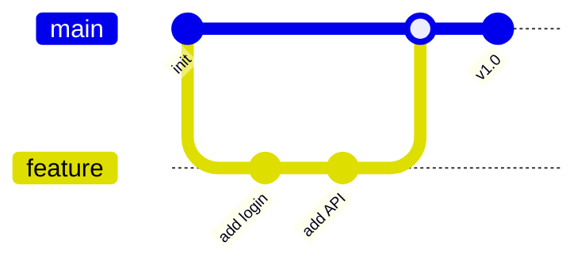
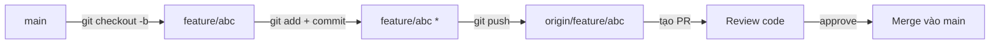
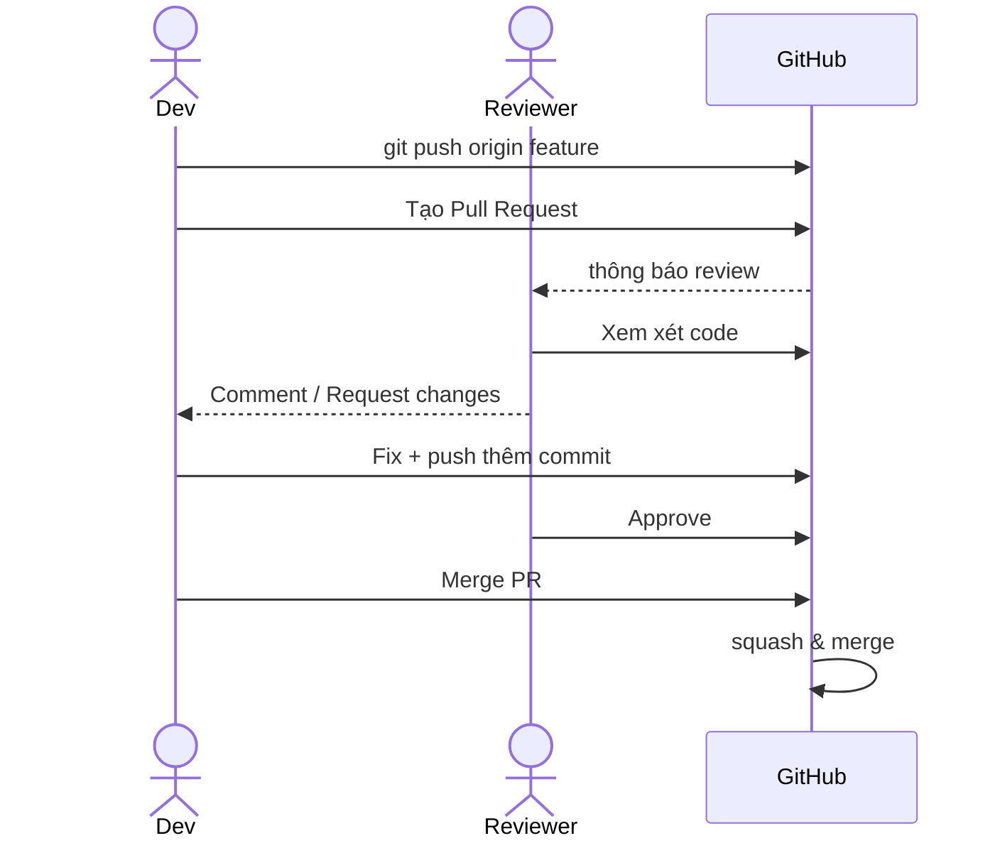
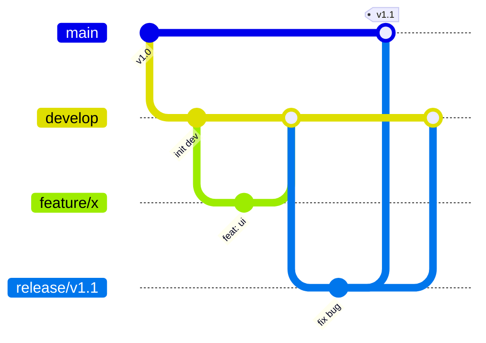
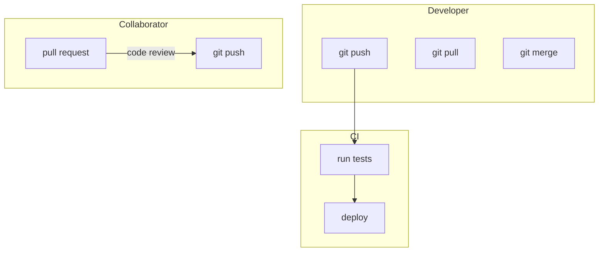
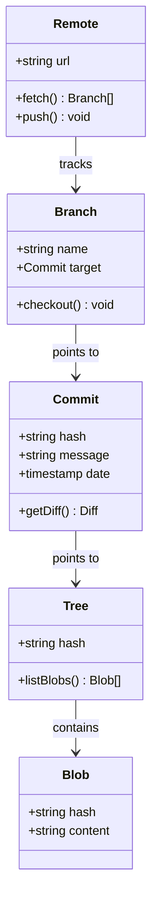
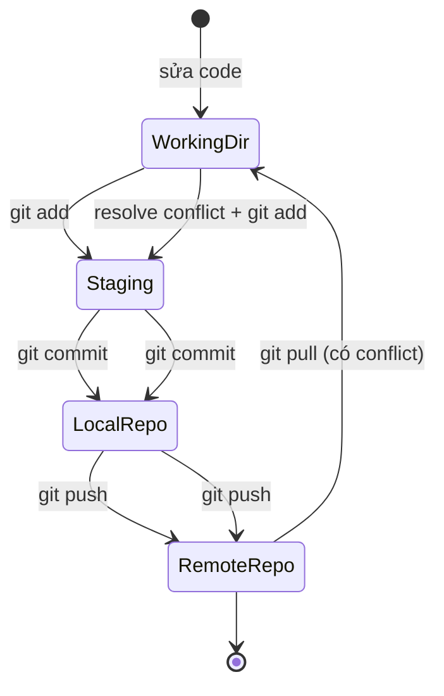
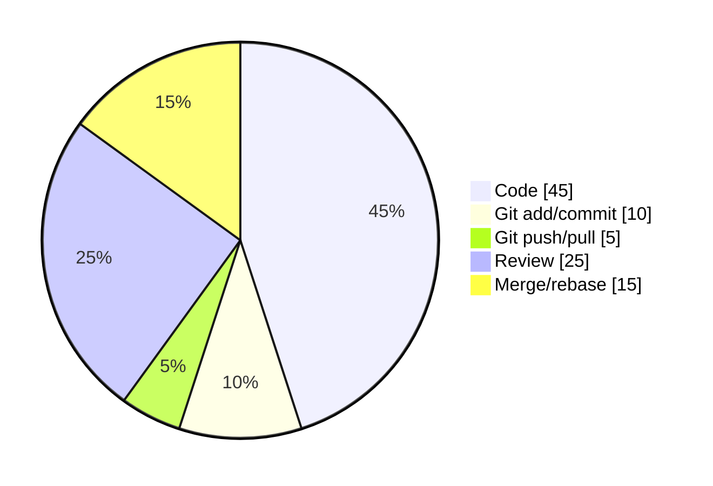
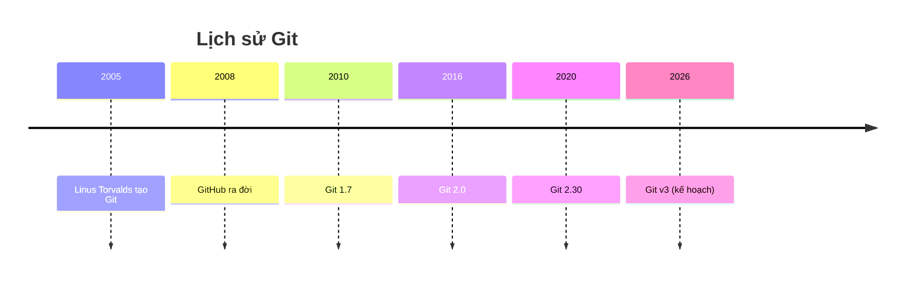

## Git branch cơ bản

## Quy trình feature branch

## Pull request & code review

## Git flow chuẩn (Vincent Driessen)

## Use case — Git với remote

## Class diagram — cấu trúc object Git

## Activity diagram — quy trình commit

## Pie chart — thời lượng các thao tác Git

## Timeline — lịch sử Git

## Giải thích

| Diagram | Dùng để |
|---------|---------|
| **`gitGraph`** | Vẽ cây Git commit/branch trực quan |
| **`flowchart`** | Sơ đồ luồng công việc, ca sử dụng (use case) |
| **`sequenceDiagram`** | Tương tác giữa người/dịch vụ theo thời gian |
| **`classDiagram`** | Cấu trúc object, quan hệ giữa các lớp |
| **`stateDiagram-v2`** | Trạng thái & chuyển tiếp (activity) |
| **`pie`** | Biểu đồ tròn, phân bố dữ liệu |
| **`timeline`** | Mốc thời gian, lịch sử |

Tất cả đều là Mermaid — viết bằng cú pháp text, render tự động ở client.
